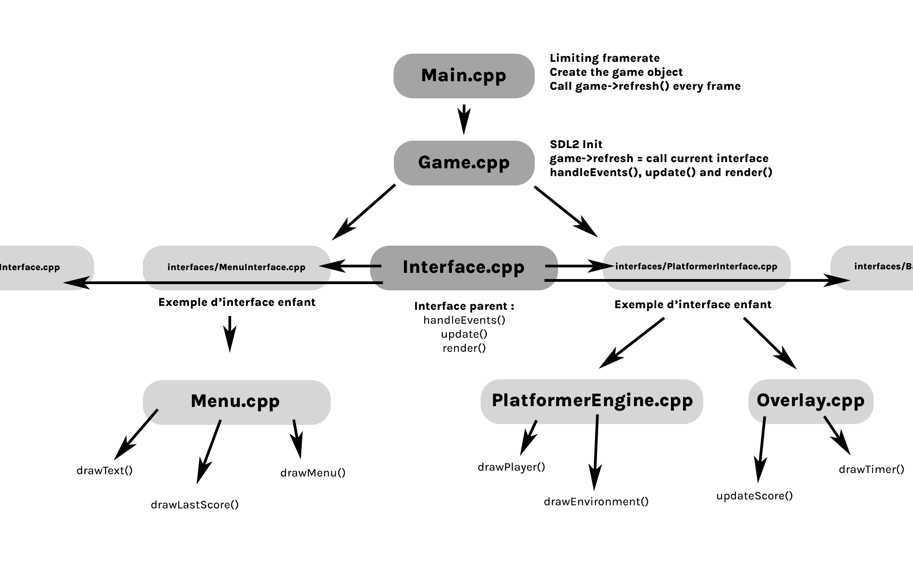

# SDL2_Boilerplate with interfaces system
### by [Mattéo Leclercq](https://github.com/MatteoL-W/)

Thanks to [Enguerrand](https://github.com/dsmtE) for the CMake help 😄

The CMake should be working with **MinGW builder** and **Linux** !

# Don't forget to remove this and write your own README.md 😄
